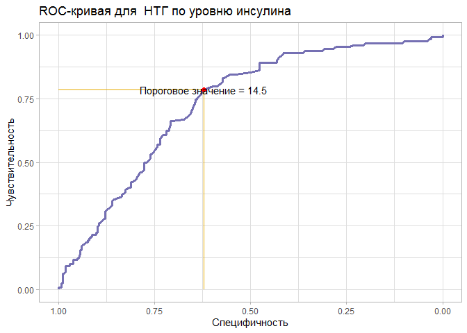

clin_lab
================
Alisa Seleznyova
2022-11-02

# Загрузка и обработка данных.

<br>

``` r
df <- read.csv("diabetes.csv")
glimpse(df)
```

    ## Rows: 768
    ## Columns: 9
    ## $ Pregnancies              <int> 6, 1, 8, 1, 0, 5, 3, 10, 2, 8, 4, 10, 10, 1, ~
    ## $ Glucose                  <int> 148, 85, 183, 89, 137, 116, 78, 115, 197, 125~
    ## $ BloodPressure            <int> 72, 66, 64, 66, 40, 74, 50, 0, 70, 96, 92, 74~
    ## $ SkinThickness            <int> 35, 29, 0, 23, 35, 0, 32, 0, 45, 0, 0, 0, 0, ~
    ## $ Insulin                  <int> 0, 0, 0, 94, 168, 0, 88, 0, 543, 0, 0, 0, 0, ~
    ## $ BMI                      <dbl> 33.6, 26.6, 23.3, 28.1, 43.1, 25.6, 31.0, 35.~
    ## $ DiabetesPedigreeFunction <dbl> 0.627, 0.351, 0.672, 0.167, 2.288, 0.201, 0.2~
    ## $ Age                      <int> 50, 31, 32, 21, 33, 30, 26, 29, 53, 54, 30, 3~
    ## $ Outcome                  <int> 1, 0, 1, 0, 1, 0, 1, 0, 1, 1, 0, 1, 0, 1, 1, ~

<br> Заменим нули в переменных BloodPressure, Insulin, BMI, Glucose,
SkinThickness на NA. Кроме того, переведем глюкозу в ммоль/л. <br>

``` r
df <- df %>%
  mutate(across(c(BloodPressure, Insulin, BMI, Glucose,  SkinThickness), ~ifelse(.x == 0, NA, .x)),
         Glucose_mml = round(Glucose / 18, 1),
         Glucose_mml = as.numeric(Glucose_mml))
```

<br>

# У какого количества пациентов из датасета присутствует нарушенная толерантность к глюкозе (НТГ)? Сколько в датасете пациентов, у которых нет НТГ?

<br>

``` r
df <- df %>%
 mutate(prediabetes = Glucose_mml >= 7.8)

table(df$prediabetes)
```

    ## 
    ## FALSE  TRUE 
    ##   566   197

<br> НТГ можно наблюдать у 197 пациентов. У 566 пациентов он
отсутствует. <br>

# Как выглядит ROC-кривая для предсказания сахарного диабета по переменной, характеризующей уровень гликемии? Постройте график.

``` r
roc_1 <- roc(Outcome ~ Glucose_mml, data = df, ci = TRUE, quiet = TRUE)
ggroc(roc_1, color = "#1B9E77", size = 1.2) +
  labs(x = "Специфичность", y = "Чувствительность", title = "ROC-кривая для НТГ по гликемии")+
  theme_light()
```

<!-- --> <br>

# Чему равна площадь под ROC-кривой, которую вы построили в вопросе 2?

``` r
roc_1$auc
```

    ## Area under the curve: 0.7932

# Чему равен 95% двусторонний ДИ для площади под ROC-кривой, которую вы построили в вопросе 2?

``` r
roc_1$ci
```

    ## 95% CI: 0.7603-0.826 (DeLong)

# Постройте ROC-кривую и определите, какое пороговое значение является оптимальным для предсказания сахарного диабета по уровню инсулина? Какой чувствительностью и специфичностью обладает данный порог?

``` r
roc_best <- roc_1 %>%
  coords(x = "best", best.method = "closest.topleft")
roc_best
```

    ##   threshold specificity sensitivity
    ## 1      6.85   0.7303823   0.7067669

``` r
df1 <- data.frame(x = c(1, roc_best$specificity), y = roc_best$sensitivity)
df2 <- data.frame(x = roc_best$specificity, y = c(0, roc_best$sensitivity))
ggroc(roc_1, color = "#7570B3", size = 1.2) +
  geom_line(aes(x = x, y = y),data = df1, size = 0.5, color = "#E6AB02") +
  geom_line(aes(x = x, y = y),data = df2, size = 0.5, color = "#E6AB02") +
  geom_point(aes(x = specificity, y = sensitivity), roc_best, color = "red", size = 2) +
  geom_text(aes(x = specificity, y = sensitivity, label = "Пороговое значение = 6,85"), roc_best) +
  labs(x = "Специфичность", y = "Чувствительность", title = "ROC-кривая для  НТГ по уровню инсулина") + 
  theme_light()
```

<!-- --> <br>

# Какая из количественных переменных в датасете обладает наибольшей площадью под ROC-кривой? Как вы можете интерпретировать это знание? Какая количественная переменная имеет наименьшую площадь?

Из пункта про упростить жизнь!

``` r
df %>% 
    select(-Glucose, -prediabetes) %>% 
    pivot_longer(cols = -Outcome) %>% 
    group_by(name) %>% 
    summarise(AUC = roc(Outcome, value, ci = T,  quiet = TRUE)$ci[2] %>% round(3))
```

    ## # A tibble: 8 x 2
    ##   name                       AUC
    ##   <chr>                    <dbl>
    ## 1 Age                      0.687
    ## 2 BloodPressure            0.608
    ## 3 BMI                      0.687
    ## 4 DiabetesPedigreeFunction 0.606
    ## 5 Glucose_mml              0.793
    ## 6 Insulin                  0.732
    ## 7 Pregnancies              0.62 
    ## 8 SkinThickness            0.663

Наибольшая площадь под кривой в датасете у глюкозы, что логично, если
учесть, что критерий НТГ – это уровень повышение гликемии ≥ 7.8 ммоль/л
на 120 минуте теста на толерантность к глюкозе. Наименьший - у индекса,
отражающего вероятность наличия диабета на основании наследственного
анамнеза. Вероятно, это может свидетельствовать в пользу того, что не
всегда диабет развивается при наличии в наследственном анамнезе, он
генетически гетерогенен и может вызываться разными группами генов,
поэтому сложен для прогнозирования его наследования.
