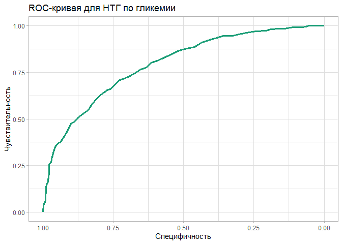

clin_lab
================
Alisa Seleznyova
2022-11-02

# Загрузка и обработка данных.

<br>

``` r
df <- read.csv("diabetes.csv")
summary(df)
```

    ##   Pregnancies        Glucose      BloodPressure    SkinThickness  
    ##  Min.   : 0.000   Min.   :  0.0   Min.   :  0.00   Min.   : 0.00  
    ##  1st Qu.: 1.000   1st Qu.: 99.0   1st Qu.: 62.00   1st Qu.: 0.00  
    ##  Median : 3.000   Median :117.0   Median : 72.00   Median :23.00  
    ##  Mean   : 3.845   Mean   :120.9   Mean   : 69.11   Mean   :20.54  
    ##  3rd Qu.: 6.000   3rd Qu.:140.2   3rd Qu.: 80.00   3rd Qu.:32.00  
    ##  Max.   :17.000   Max.   :199.0   Max.   :122.00   Max.   :99.00  
    ##     Insulin           BMI        DiabetesPedigreeFunction      Age       
    ##  Min.   :  0.0   Min.   : 0.00   Min.   :0.0780           Min.   :21.00  
    ##  1st Qu.:  0.0   1st Qu.:27.30   1st Qu.:0.2437           1st Qu.:24.00  
    ##  Median : 30.5   Median :32.00   Median :0.3725           Median :29.00  
    ##  Mean   : 79.8   Mean   :31.99   Mean   :0.4719           Mean   :33.24  
    ##  3rd Qu.:127.2   3rd Qu.:36.60   3rd Qu.:0.6262           3rd Qu.:41.00  
    ##  Max.   :846.0   Max.   :67.10   Max.   :2.4200           Max.   :81.00  
    ##     Outcome     
    ##  Min.   :0.000  
    ##  1st Qu.:0.000  
    ##  Median :0.000  
    ##  Mean   :0.349  
    ##  3rd Qu.:1.000  
    ##  Max.   :1.000

<br> Заменим нули в переменных BloodPressure, Insulin, BMI, Glucose,
SkinThickness на NA. Кроме того, переведем глюкозу в ммоль/л. <br>

``` r
df <- df %>%
  mutate(across(c(BloodPressure, Insulin, BMI, Glucose,  SkinThickness), ~ifelse(.x == 0, NA, .x)),
         Glucose_mml = round(Glucose / 18, 1),
         Glucose_mml = as.numeric(Glucose_mml))
```

<br>

# У какого количества пациентов из датасета присутствует нарушенная толерантность к глюкозе (НТГ)? Сколько в датасете пациентов, у которых нет НТГ?

<br>

``` r
df <- df %>%
 mutate(prediabetes = Glucose_mml >= 7.8)

table(df$prediabetes)
```

    ## 
    ## FALSE  TRUE 
    ##   566   197

<br> НТГ можно наблюдать у 197 пациентов. У 566 пациентов он
отсутствует. <br>

# Как выглядит ROC-кривая для предсказания сахарного диабета по переменной, характеризующей уровень гликемии? Постройте график.

``` r
roc_1 <- roc(Outcome ~ Glucose_mml, data = df, ci = TRUE, quiet = TRUE)
ggroc(roc_1, color = "#1B9E77", size = 2) +
  labs(x = "Специфичность", y = "Чувствительность", title = "ROC-кривая для НТГ по гликемии")+
  theme_light()
```

<!-- --> <br>

# Чему равна площадь под ROC-кривой, которую вы построили в вопросе 2?

``` r
roc_1$auc
```

    ## Area under the curve: 0.7932

# Чему равен 95% двусторонний ДИ для площади под ROC-кривой, которую вы построили в вопросе 2?

``` r
roc_1$ci
```

    ## 95% CI: 0.7603-0.826 (DeLong)
